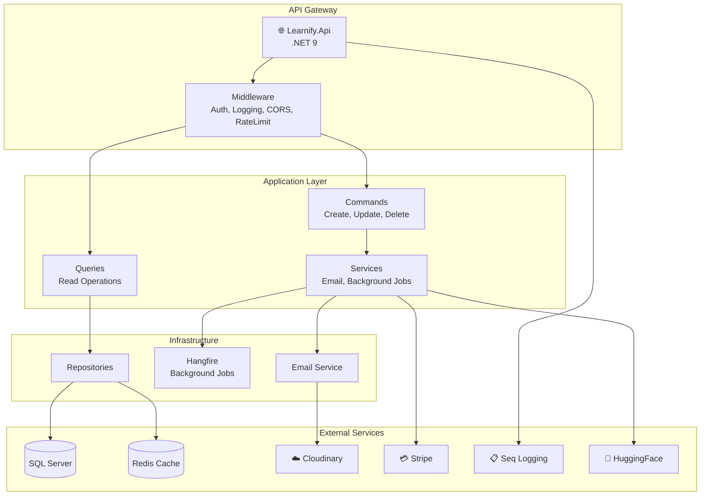
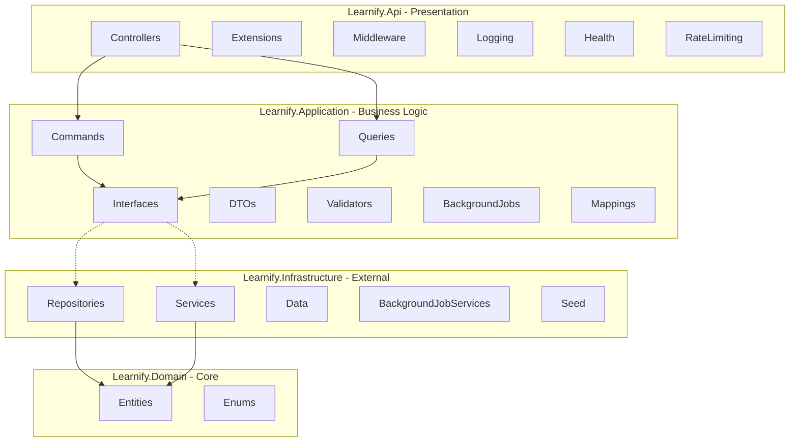
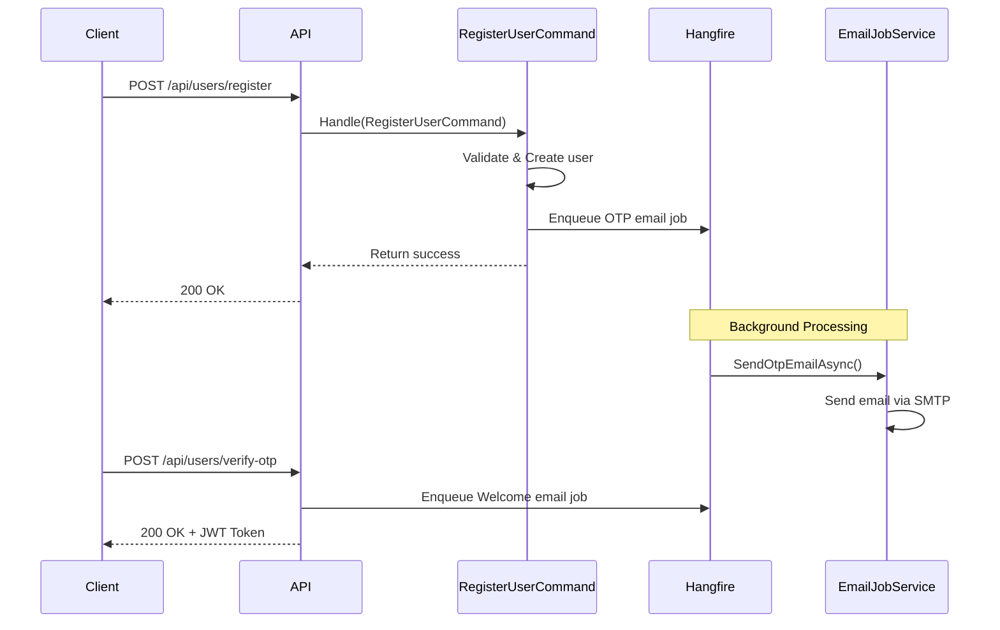
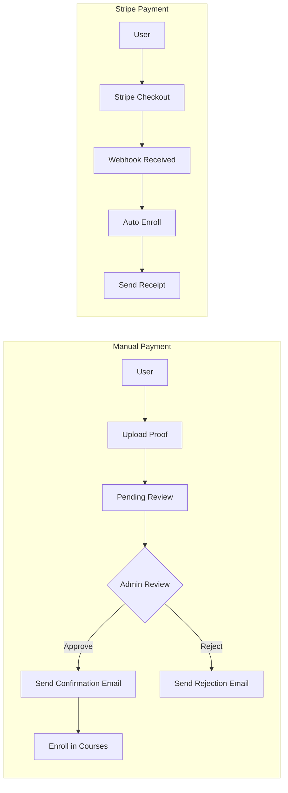
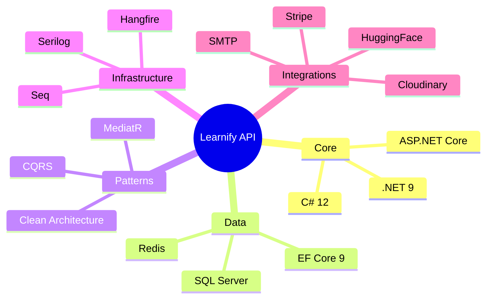
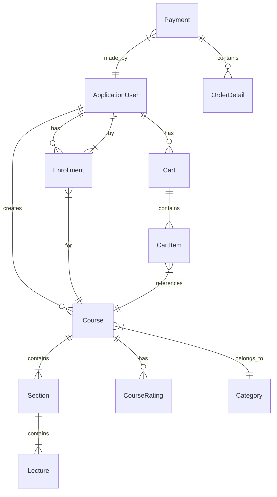

# Learnify Backend Architecture

## System Overview



---

## Clean Architecture Layers



---

## Data Flow: User Registration



---

## Payment Flow



---

## Tech Stack



---

## Project Structure

```
src/
├── Learnify.Api/                     # Presentation Layer
│   ├── Controllers/                  # 25 REST API controllers
│   │   ├── UsersController.cs        # Auth, registration, profile
│   │   ├── TwoFactorController.cs    # 2FA setup/verify
│   │   ├── CoursesController.cs      # Course CRUD
│   │   ├── AdminController.cs        # Admin operations
│   │   └── ...
│   ├── Extensions/                   # Service registrations
│   │   ├── HangfireExtensions.cs     # Background job config
│   │   └── SerilogExtensions.cs      # Logging config
│   ├── Health/                       # Health check implementations
│   │   ├── DatabaseHealthCheck.cs
│   │   ├── StripeHealthCheck.cs
│   │   └── CloudinaryHealthCheck.cs
│   ├── Logging/                      # Structured logging
│   │   ├── RequestLoggingMiddleware.cs
│   │   └── CorrelationIdEnricher.cs
│   ├── Middleware/                   # Request pipeline
│   │   └── ExceptionHandlerMiddleware.cs
│   ├── RateLimiting/                 # Rate limit policies
│   └── Program.cs                    # Application entry point
│
├── Learnify.Application/             # Business Logic Layer
│   ├── Users/                        # User feature module
│   │   ├── Commands/                 # Register, Login, etc.
│   │   ├── Queries/                  # GetUser, GetProfile
│   │   └── DTOs/                     # UserDto, LoginResponse
│   ├── Courses/                      # Course management
│   ├── Enrollments/                  # Student enrollments
│   ├── Payments/                     # Payment processing
│   ├── TwoFactorAuth/                # 2FA logic
│   ├── BackgroundJobs/               # Job interfaces
│   │   ├── IEmailJobService.cs
│   │   └── ICleanupJobService.cs
│   ├── Common/                       # Shared components
│   │   ├── Behaviors/                # MediatR behaviors
│   │   ├── Responses/                # API response models
│   │   └── Validators/               # FluentValidation
│   └── Mappings/                     # AutoMapper profiles
│
├── Learnify.Infrastructure/          # External Concerns
│   ├── Data/                         # Database layer
│   │   ├── ApplicationDbContext.cs   # EF Core context
│   │   ├── Migrations/               # Database migrations
│   │   └── EntityConfigurations/     # Fluent API configs
│   ├── Repositories/                 # Data access
│   │   └── GenericRepository.cs
│   ├── Services/                     # External integrations
│   │   ├── EmailService.cs
│   │   ├── StripeService.cs
│   │   ├── CloudinaryService.cs
│   │   └── AiChatService.cs
│   ├── BackgroundJobs/               # Hangfire implementations
│   │   ├── EmailJobService.cs
│   │   └── CleanupJobService.cs
│   ├── Seed/                         # Database seeding
│   └── DependencyInjections.cs       # DI registration
│
└── Learnify.Domain/                  # Core Domain
    ├── Entities/                     # 23 domain entities
    │   ├── ApplicationUser.cs
    │   ├── Course.cs
    │   ├── Section.cs
    │   ├── Lecture.cs
    │   ├── Enrollment.cs
    │   ├── Payment.cs
    │   └── ...
    └── Enums/                        # Domain enumerations
        └── PaymentStatus.cs
```

---

## API Controllers Overview

| Controller | Endpoints | Description |
|------------|-----------|-------------|
| UsersController | 8 | Auth, registration, profile |
| TwoFactorController | 6 | 2FA setup, verify, disable |
| CoursesController | 7 | Course CRUD operations |
| CategoriesController | 5 | Category management |
| SectionsController | 4 | Course section management |
| LecturesController | 6 | Lecture CRUD, video upload |
| EnrollmentsController | 5 | Student enrollments |
| PaymentsController | 4 | Stripe checkout |
| ManualPaymentsController | 4 | Manual payment requests |
| AdminController | 12 | User/course management |
| AdminReportsController | 4 | Analytics & reports |
| InstructorController | 8 | Instructor dashboard |
| AiChatController | 3 | AI assistant |
| CartsController | 4 | Shopping cart |

---

## Domain Entities



---

## External Service Integrations

| Service | Purpose | Configuration |
|---------|---------|---------------|
| SQL Server | Primary database | ConnectionStrings:DefaultConnection |
| Redis | Caching, session | ConnectionStrings:Redis |
| Cloudinary | Video/image hosting | Cloudinary:* |
| Stripe | Payment processing | Stripe:SecretKey |
| Seq | Log aggregation | Serilog:Seq:* |
| SMTP | Email delivery | Email:* |
| HuggingFace | AI chat | AiChat:ApiKey |
